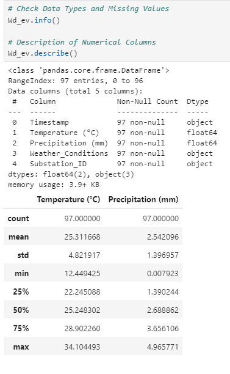
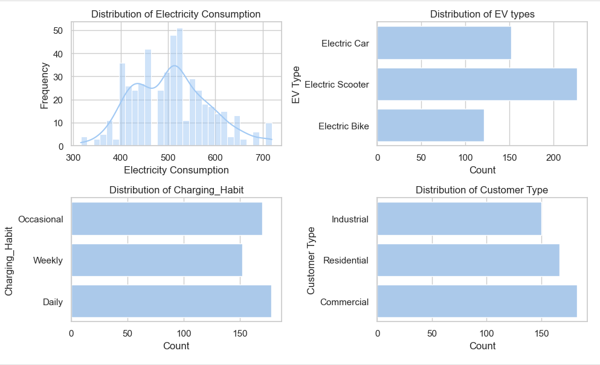

# Distribution_Network_Analysis_for_Power_Charge_Utilities

## Project Concept:
Using *python* to Perform Distribution Network Analysis on Power Charge Utilities. Working with popular Python Libraries such as Numpy, Pandas, Matplotlib, Seaborn and GeoPandas - For Distribution Network Geographics

## Key learning points(Learning Skills)
- Explore Exploratory Data Analysis
- Capacity Assessment
- Network Optimization
- Geographics Analysis & Visualization
- Data Transformation
- Reporting and Recommendations

## Tech Stack:
- Programming Language – Python
__Libraries:__
- __Numpy:__ For performing Mathematical operations over data
- __Pandas:__ For Data Analysis and Manipulation
- __Matplotlib.pyplot:__ For Data Visualization
- __Seaborn:__ For Data Visualization
- __GeoPandas:__ For Distribution of Network Geographics (Visualization)
- __Jupyter Notebook:__ For Documenting and presenting the analysis

## Business Introduction:
PowerCharge Utilities is a prominent electric utility provider operating in a dynamic and evolving energy landscape. The company’s primary mission is to ensure the reliable delivery of electrical power to millions of customers across urban and suburban areas. PowerCharge Utilities has established itself as a key player in the energy sector, focusing on sustainability and adapting to emerging technologies.
The energy sector has witnessed a significant transformation in recent years driven by environmental concerns, regulatory changes, and technological advancements. One of the most notable developments has been the rapid adoption of electric vehicles (EVs) as part of global efforts to reduce carbon emissions and combat climate change.

## Business Overview/Problem:
Power Charge Utilities encounters several critical challenges due to the growing adoption of electric vehicles:

__A. Increased Load Demand:__ Widespread EV adoption has caused a significant spike in electricity demand, particularly during peak charging times. This strains the existing distribution network infrastructure.

__B. Grid Overloads:__ Frequent overloads in the distribution network leads to voltage fluctuations and outages in specific areas, affecting overall grid reliability.

__C. Customer Satisfaction:__ EV owners expect reliable and convenient charging services. Ensuring this level of service is essential to maintaining customer satisfaction and loyalty.

__D. Cost Management:__ Balancing increased load demands and grid reliability comes at a significant cost. PowerCharge Utilities must optimize network investments to manage expenses effectively.
 
## Rationale for the Project:
Distribution Network Analysis in the energy industry refers to studying and evaluating the electrical distribution networks that deliver electricity from high-voltage transmission lines to end-users, such as homes, businesses, and industrial facilities. The view case is EV charging stations where customers come in to charge their vehicles. This analysis becomes even more critical with the rise of EVs, as it transforms the energy landscape. 

## Top Five Reasons for the Project's Significance:
 
- _A. Customer Retention:_ Maintaining a reliable EV charging experience is essential for retaining existing customers who have embraced EVs.
- _B. Revenue Growth:_ Accommodating the growing demand for EV charging services opens new revenue streams and capitalizes on the expanding EV market.
- _C. Sustainability Goals:_ Supporting EVs aligns with the company's sustainability objectives, contributing to reduced greenhouse gas emissions.
- _D. Regulatory Compliance:_ Meeting regulatory standards for grid reliability and capacity planning is vital to avoid penalties and ensure operational excellence.
- _E. Technological Innovation:_ Embracing data analytics empowers, PowerCharge Utilities to stay at the forefront of technological innovation in the energy sector.

## Aim of the Project:
_The project aims to achieve the following objectives:_
**A. Assess Network Capacity:** Conduct a comprehensive analysis of the distribution network's current capacity to handle increased load from EV charging stations
**B. Identify Bottlenecks:** Identify potential bottlenecks and vulnerabilities within the distribution network that could hinder reliable electricity delivery to EV charging stations
**C. Optimize Network Upgrades:** Develop a data-driven strategy for network upgrades that maximizes efficiency, minimizes costs, and ensures grid reliability.

## Data Description:
 __The Data set for the Distribution Network Analysis:__

_A. Electric Vehicle (EV) Distribution Data:_
- __Timestamp__: Date and time of data points.
- __Geographical Area__: Location of each data point.
- __Customer Type__: Categorization of customers (e.g., residential, commercial).
- __Electricity Consumption (kWh)__: Amount of electricity consumed.
- __EV Charging Station Location__: Latitude and longitude of charging stations.
- __EV Charging Station Specifications__: Details about charging stations.
- __EV Type__: Type of electric vehicle.
- __Charging Habit__: Charging behavior (e.g., daily, weekly).
- __Number of EVs__: Count of electric vehicles.
 
_B. Geospatial Data (Distribution Network Geographies):_ 
- __Substation ID__: Unique identifier for distribution substations. (Primary Key)
- __Substation Location__: Geographic coordinates of substations.
- __Transmission Line Capacity (MW)__: Capacity of transmission lines.
 
_C. Weather Data:_
- __Timestamp__: Date and time of weather data
- __Temperature(°C)__: Ambient temperature.
- __Precipitation (mm)__: Precipitation amount (rainfall or snowfall).
- __Weather Conditions__: Categorization of weather conditions (e.g., Clear, Rainy).

## Structure of Data:
To understand the structure of the data, have an idea of the number of rows in the data, data types of each column, checking for missing values, the statistical summary of the numerical columns, and to know the categorical data:
The structure of data will be achieved through; .info(), .describe()

- **Geospatial Data (Distribution Network Geographies):**
- :   

- **Electric Vehicle (EV) Distribution Data Structure:**
- :

- **Weather Data Data Structure:**
- 
       
## Project Scope:
_A. Exploratory Data Analysis:_ Conduct EDA to gain insights into electricity consumption patterns and network performance. 
 
_B. Capacity Assessment:_ Utilize historical data to assess the current distribution network's capacity and identify areas with high demand growth. 

_C. Network Optimization:_ Utilize optimization algorithms to identify cost-effective network upgrades that address capacity shortfalls.
 
_D. Reporting and Recommendations:_ Present findings, including capacity assessments and upgrade recommendations, to the executive team for decision-making. Exploratory Data Analysis: Explore the data to understand its characteristics and discover patterns. 
 
_E. Data Transformation:_ Prepare the data for analysis by transforming, encoding, or normalizing it. 
 
_F. Data Analysis:_ Analyze data to understand pattern in order to generate insights that will be visualized. 
 
_G. Data Visualization:_ Create visual representations to communicate insights effectively. Interpretation and Insight Generation: Extract meaningful insights and interpret the results.

## ANALYSIS:
### Exploratory Data Analysis
Deals with both Univariate (Single data point) and Bivariate(Two Data Point) Data Analysis:

#### Univariate Data Analysis:

- __Visualize the distribution of electricity Consumption:__
  Analysis Distribution of Electricity consumption, EV types, Charging habits,and Customer type.

##### From the Above subplots we can see the following from the visuals:

- Distribution consumption is centered around 500 kWh with instances of higher and lower consumptions
- Most Common Distribution of EV types is the Electric Scooter with a count of 200 numbers followed by Electric - - Cars with 150 numbers and finally Electric Bikes with about 120 numbers
- Most Customers charging Habit is Daily, followed by Occasionally and weekly
- Most Customers are Commercial Followed by Residential with Industrial being the least

#### Bivariate Data Analysis:
Using geospatial data to visualize locations and EV Charging Stations.
Analyze capacity of transmission lines.

- From the above map, The Stations seem are properly distributed throughout North America

### Observations:
There seems not to be any correlation between betwen the plot values:
- For Electricity Vs Temperature there is no clear relationship as the data points are all scattered.
- Same Applies for Electricity Vs Precipitation as the data points are also scattered.

Based on the current temperature and precipitation factors, they do not have correlation with electricity consumption, this suggests, these factors do not influence electricity consumption in the distribution network.
It is still important to consider temperature and precipitation which are weather data for network analysis as extreme weather conditions can have impact on distribution network and its component, potentially leading to outages and other issues. 

## INSIGHTS:

_a. Electricity Consumption:_ The Electricity consumption is mostly centered around 500kWh, with with instances of higher and lower consumptions. This indicates varied demand at different times and locations.

_b. EV Types and Charging Habits:_ Electric scooters is the most common types of EVs. Most customers charge thier EVs daily, indicating a consistent daily load on the distribution network

_c. Consumer Type:_ Commercial Customers malke up the most consumer types.

_d. Geospatial Distribution:_ The spatial distribution od substations and EV charging stations is widespread.

_e. Geospatial Distribution:_ The EV charging station seems to be far from its corresponding substation

_f. Network Capacity:_ Some substations have high Consumption_to_Capacity_Ratio, indicating potentialbottlenecks and overloads in the network. There is also no correlation with the number of EVs per station and the Consumption_to_Capacity_Ratio, this shows that Number of EVs is not a factor for overload.                                               
_g. Weather Correlation:_ The correlation between weather conditions (temperature and precipitation) is weak inthe current dataset, suggesting that other factors might be more influencial in affecting electricity consumption

## The Optimization Strategy/Recommendation
Based on the analysis of the busniess problem at hand, the following should be incoporated into the business;
_1. Potential Substation Upgrades:_ Prioritize upgrades at substations where the Consumption_to_Capacity_Ration is high, indicating potential overloads, upgrade the transmission lines because the EV Charging Stations are too far from thier corresponding Substations.

_2. Geospatial Analysis for Upgrade Planning:_ Use geospatial nalysis to determine the optimal locations for new substations or upgrade to existing ones. Consider factors like the proximity to high load demand areas(areas with high consumption to capacity ratio) and geograpical constraints.

_3. Demand Side Management:_ Implement demand-side management strategies to manage the load on the grid. Encourage customers to change thier EVs during off-peak hours through incentives to dynamic pricing.

_4. Advanced Monitoring and Analytics:_ Deploy advanced Monitoring systems to continously monitor the health and performance of distribution network. Use analytics to predict increased capacity and take preventive action.

_5. Cost-Benefit-Analysis:_ Conduct a comprehensive cost benefit analysis to differentiate upgrade options, Consider factors like the cost of upgrades, operational costs, poetential revenue from increased capacity and the impact on service relativity and customer satisfaction

_6. Customer Engagemen:_ Enage with customers to undersatnd thier needs and expectations. Provide Clear communication about network upgrades and how they will enhance service relaibility and meet the growing demand for EV charging.

_7. Continous Improvement:_ Continously monitor and assess the performance of the didtribution network. Gather feedback from the customers and other stakeholders and use this feedback to make urhter improvements and optimizations.

__By Following these steps, Power Charge Utilities can develop an effective optimization startegy to maintain the increased load demand from EV charging stations, ensure the relaibility and resilience of the ditribution network and meet the expectations of customers while all optimizing costs and ensuring regulatory compliance.__
                                                                                                                                                                                                                    

